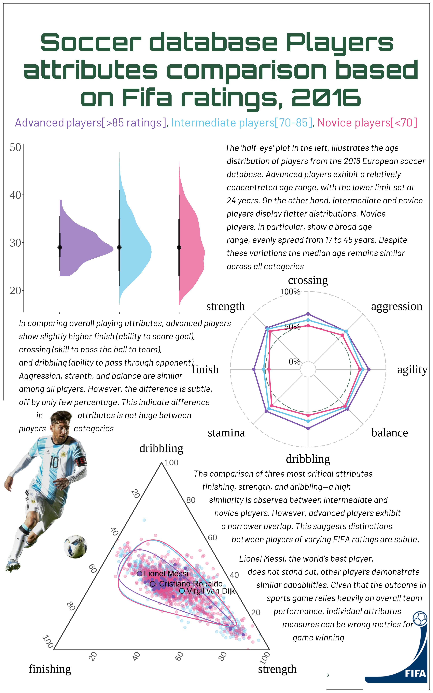

# European Soccer Players Attributes Comparison
## Introduction

This project aims to visualize and compare attributes of soccer players sourced from a European soccer database available on Kaggle. The dataset contains data on over 10,000 players, and using R exclusively, the visualization focuses on attributes such as shooting, finishing, strength, age, etc. The infographic presents insights into the differences in player attributes between advanced, intermediate, and novice categories, as classified based on FIFA average ratings from 2008 to 2016.

## Key Insights

### Age Distribution

The 'half-eye' plot illustrates the age distribution of players from the 2016 European soccer database. Advanced players exhibit a relatively concentrated age range, with the lower limit set at 24 years. On the other hand, intermediate and novice players display flatter distributions. Novice players, in particular, show a broad age range, evenly spread from 17 to 45 years. Despite these variations, the median age remains similar across all categories.

### Overall Player Attributes

In comparing overall playing attributes, advanced players show slightly higher finish (ability to score goals), crossing (skill to pass the ball to the team), and dribbling (ability to pass through opponents). Aggression, strength, and balance are similar among all players. However, the difference is subtle, off by only a few percentages. This indicates that the difference in attributes is not huge between player categories.

### Comparison of Major Attributes

The comparison of three critical attributes - finishing, strength, and dribbling - reveals a high similarity between intermediate and novice players. However, advanced players exhibit a narrower overlap. This suggests that distinctions between players of varying FIFA ratings are subtle.

### Individual Performance vs. Team Dynamics

Lionel Messi, often considered the world's best player, does not stand out significantly in the analysis. Other players demonstrate similar capabilities. This highlights that the outcome in sports games relies heavily on overall team performance, and individual attribute measures may not always be accurate metrics for game-winning.

## Project Structure

```
soccer-analysis/
├── data/                      # Data files (see data/README.md for setup)
│   ├── raw/                  # Raw SQLite database
│   ├── processed/            # Processed data
│   ├── images/               # Source images for visualizations
│   └── fonts/                # Font files
├── src/                      # Source code
│   └── analysis.R           # Main analysis script
├── outputs/                  # Generated outputs
│   └── plots/               # Individual plot outputs
├── static_image/            # Final infographic images
├── docs/                    # Documentation
└── README.md
```

## Setup Instructions

1. **Clone the repository**
   ```bash
   git clone https://github.com/Sujan-Bhattarai12/soccer-analysis.git
   cd soccer-analysis
   ```

2. **Install required R packages**
   - dplyr, RSQLite, ggplot2, ggradar, grid, magick, ggtern, tidyverse
   - showtext, patchwork, janitor, glue, ggtext, geofacet
   - cropcircles, ggpath, readr, scales, jpeg, png, ggdist

3. **Download required data**
   - See `data/README.md` for detailed instructions on obtaining the dataset

4. **Run the analysis**
   ```R
   source("src/analysis.R")
   ```

## How to Use

To view the complete infographic with detailed insights and visualizations, check the `infographics_draft.png` file in the root directory or `static_image/infographics.png`. For a more interactive experience and access to the code behind the visualizations, explore the analysis script in `src/analysis.R`.

## Credits

-   Data Source: European Soccer Database on Kaggle
-   UFO Alien Template: [UFO link](https://github.com/doehm/tidytues/blob/main/scripts/2023/week-25-ufo/ufo.png)

## Author
-   Sujan Bhattarai
  
# European Soccer Players Attributes Comparison

